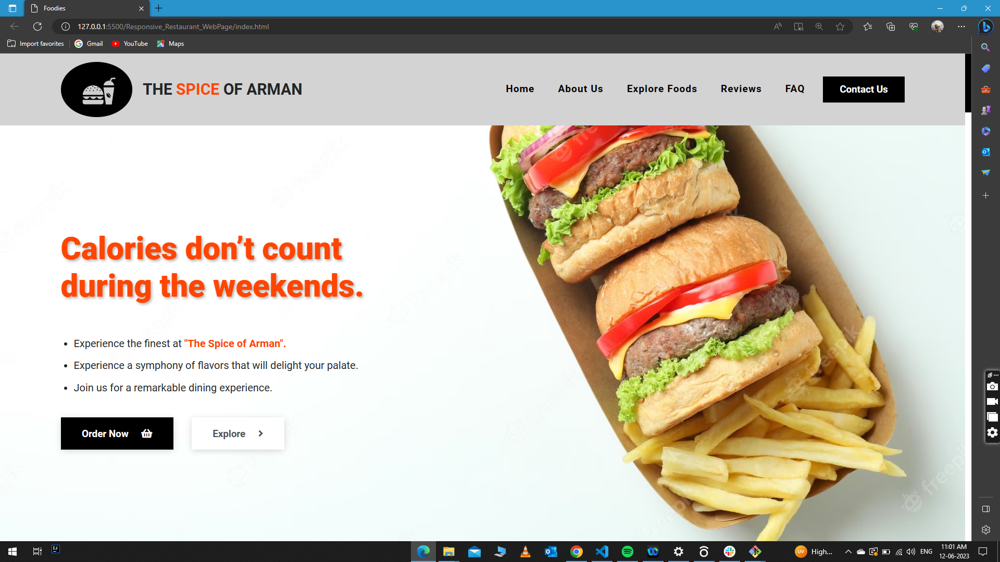

# THE SPICE OF ARMAN🍔

 .png)

 It is a simple, modern and responsive website for restaurants, made with Bootstrap5.

# 💻 During this project I have learned------

- How to structure the web page using HTML tags and elements.

- Gained knowledge of CSS styling to enhance the appearance of the website.

- Utilized Bootstrap5 to create a responsive and mobile-friendly layout for the restaurant website.

- Implemented a navigation bar using Bootstrap's navbar component to create a menu for easy website navigation.

- Integrated a carousel component to showcase testimonials or reviews.

- Implemented javascript for :

  Scroll Animation: When the user scrolls down the page, the navigation bar changes its appearance. 

  Navigation Bar Hide:When a navigation link is clicked, it removes the "show" class from the navbar collapse element, hiding the navigation menu.

  Counter Design- The counter design code animates numbers on elements from start to end values over a specified duration in one line.

- Flex box and grid usage.

- Implementation of media query.

# 🔴Live Preview:

Link: 

## 🛠️ Tech Stack
 

 

 

- Bootstrap-icons
- FontAwesome

## 🤝 Contributing

 Contributions and feature requests are welcome!

  Start by:

- Forking the project.
- Clone the project to your local machine by running `git clone https://github.com/armansaikia/Responsive_Restaurant_WebPage.git`
- `cd` into the project directory.
- Run `git checkout -b your-branch-name`.
- Make your contributions.
- Push your branch up to your forked repository.
- Open a Pull Request with a detailed description to the development(or master if not available) branch of the original project for a review.

## 🔻Credits
- This website was developed by [@armansaikia](https://github.com/armansaikia).

## 🔻Show your support

Give a ⭐️ if you like this project!